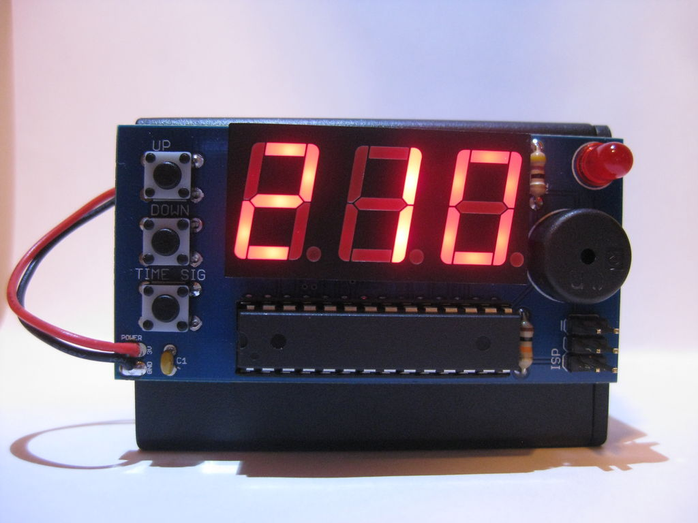

# Metronome Kit

This barebones metronome was designed as a kit which was sold on Club Jameco (discontinued). Features include a small speaker, flashing LED, and the ability to switch between several different time signature options. The kit includes a three digit seven-segment display to display the speed in beats per minute and runs off of three AA batteries.

Details for the build can be found on [Instructables](https://www.instructables.com/id/Electronic-Metronome/). 

## Bill of Materials
- ATmega328p Microcontroller (Jameco #2139111)
- IC Socket (Jameco #112300)
- 150 Ohm Resistor (Jameco #690662)
- 10k Ohm Resistor (Jameco #691104)
- 0.1 uF Capacitor (Jameco #151116)
- Three Digit Seven Segment Display (Jameco #1956493)
- Red 5mm LED (Jameco #333973)
- Tactile Switch (3x) (Jameco #119011)
- Piezo Speaker (Jameco #1874543)
- ISP Header (Jameco #115035)
- 3xAA Battery Holder with Switch (Jameco #216144)
- AA Battery (3x)
- Velcro (Optional)